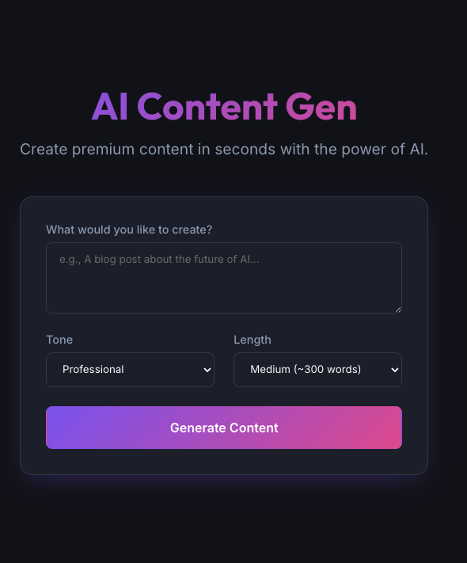

# AI Content Generator

A premium, modern web application for generating high-quality text content using Google's Gemini API. Built with React, Vite, and a custom CSS design system.



## 🚀 Features

- **AI-Powered Generation**: Leverages Google's `gemini-2.5-flash` model for fast, relevant content.
- **Premium Design**: Dark mode aesthetic with glassmorphism, gradients, and smooth animations.
- **Customizable**: Adjust tone (Professional, Casual, Witty) and length (Short, Medium, Long).
- **Responsive**: Fully optimized for desktop, tablet, and mobile devices.
- **Developer Experience**: Built on Vite for lightning-fast HMR and builds.

## 🛠️ Tech Stack

- **Frontend**: React (v18+)
- **Build Tool**: Vite
- **Styling**: Vanilla CSS (Variables, Grid/Flexbox)
- **AI Integration**: `@google/generative-ai` SDK
- **Fonts**: Inter & Outfit (Google Fonts)

## ⚙️ Installation

1.  **Clone the repository**:

    ```bash
    git clone https://github.com/yourusername/ai-content-generator.git
    cd ai-content-generator
    ```

2.  **Install dependencies**:
    ```bash
    npm install
    ```

## 🔑 Configuration

To use the AI features, you need a Google Gemini API key.

1.  **Get an API Key**: Visit [Google AI Studio](https://makersuite.google.com/app/apikey).
2.  **Set up Environment**:
    Create a `.env` file in the root directory:
    ```bash
    touch .env
    ```
3.  **Add your Key**:
    Add the following line to `.env`:

    ```env
    VITE_GOOGLE_API_KEY=your_actual_api_key_here
    ```

    > [!WARNING]
    > Never commit your `.env` file to version control. It is already added to `.gitignore`.

## 🏃‍♂️ Usage

1.  **Start the development server**:
    ```bash
    npm run dev
    ```
2.  Open your browser at `http://localhost:5173`.
3.  Enter a prompt, select your settings, and click **Generate Content**.

## 🏗️ Project Structure

```
src/
├── components/
│   ├── GeneratorForm.jsx    # Input form for prompts and settings
│   └── ResultDisplay.jsx    # Displays generated text with copy feature
├── services/
│   └── aiService.js         # Google Gemini API integration
├── App.jsx                  # Main application layout
├── index.css                # Global styles and design system variables
└── main.jsx                 # Entry point
```

## 📜 License

MIT
